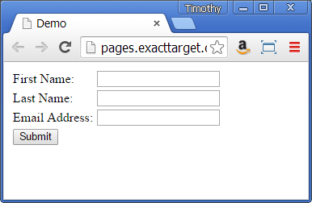
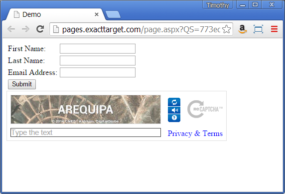

Have you ever been annoyed at CAPTCHA technology on a page?  And then later, much to your chagrin been the person implementing CAPTCHA?  I know your pain... this post comes from exactly that. 

The following is an example of using Google's reCAPTCHA on SFMC landing pages.  Although this is tailored landing page solution, it should be easily adapted for use in other environments. It pains me a little to say this, but Google did a really nice job making this easy to implement.  Good documentation was a big plus as well. 

### Prerequisites
1. Set up <a href='http://help.exacttarget.com/en/documentation/exacttarget/content/microsites'>microsites</a>  in your SFMC account, with 3 landing pages of type HTML.
2.  <a href='http://www.google.com/recaptcha/intro/index.html'>Register.</a>
   * Get your keys, both public and private.
   * Register a domain there (since my landing page code is on pages.exacttarget.com, this is what I registered).
3. (Optional) Make sure that the page you want reCAPTCHA on has some decent client side validation on it.  Passing bad data is a pretty good way to mess yourself up before you even get started.
4. A basic understanding of SFMC AMPscript, SFMC SSJS, SFMC landing pages, javascript and html would help a lot.

 

### First Page
The first page we need is going to be the form which we're going to post from.  (For the sake of this demo, I'm not actually posting the data.  Do remember these are pages within the SFMC).   For now, I'm going to start with a basic, seemingly inconsequential form:

 After reCaptcha:

We're going to paste in the following script block into the header:

    
    
All posting is essentially disabled via javascript, except in the line `if(keyStr==="true")`.  The javascript needs to be wired up to the onsubmit method in the form tag.  

Next, we need to put some javascript somewhere in the body tags, to actually put the reCAPTCHA widget onto the page.  Note there are two separate scripts:

    
    

"captchadiv" is the name of some div that you have on your page.  My page has the following line on it:

    

###The Processing Page
Next up, we have the page where the magic happens, the processing page.  Although it may at first glance look like this page isn't necessary, this is where the private key lives (and it lives server side for security purposes).   On the second page, put the following code:

    %%[
        SET @c = RequestParameter("challenge")
        SET @r = RequestParameter("response") 
    ]%%
    

No need to change the IP address, or the header names and values, this are just necessary for the POST.  After you create this page, make sure to put it's URL back on the original page.  

###Last Page - Success!
The last page to create is mainly a place holder for this example.  Mine is just an HTML page that says "Hooray! Captcha worked!", and yours can say whatever.  The URL of this page should go in the action attribute in the form tag on the first page.  

Congratulations! In just a few minutes, you were able to set up reCAPTCHA on a landing page.

